# Hotstuff CLI

<p align="center">
  
</p>

<p align="center">
  SDK-compatible market + trading CLI for Hotstuff.<br/>
  Built for fast terminal workflows with clear auth checks.
</p>

<p align="center">
  <a href="https://www.npmjs.com/package/hotstuff-market-cli">
    
  </a>
  =18" />
  
</p>

## Terminal Preview

<p align="center">
  
</p>

## Features

- Prompted credential setup stored in `./credentials.json`
- Market data commands for price discovery and monitoring
- Trade commands for place/cancel/order tracking
- Mainnet/testnet switching via env vars
- SDK-compatible transport and signing wrappers that mirror the latest request shapes

## Install

```bash
npm install -g hotstuff-market-cli
```

Aliases available after install:

- `hotstuff`
- `hotstuff-market`
- `cli`

## Quick Start

```bash
# 1) Configure API credentials once
hotstuff auth setup

# 2) Confirm auth is ready
hotstuff auth status

# 3) Inspect market
hotstuff market price BTC

# 4) Place an order
hotstuff trade buy BTC 0.01 70000

# 5) Check account state
hotstuff trade orders --limit 20
hotstuff trade positions
```

If credentials are missing or the signer is not authorized, the CLI stops before placing the order and tells you which auth step to fix first.
`auth setup` always asks for the main account address and agent private key, then overwrites `./credentials.json`.

## Commands

### Auth

```bash
hotstuff auth setup
hotstuff auth setup --private-key 0x... --address 0x...
hotstuff auth status
hotstuff auth clear
```

Recommended order:

1. Run `hotstuff auth setup` and enter the main account address plus agent key when prompted
2. Run `hotstuff auth status`
3. Trade only after the status output shows the expected account and signer

### Market

```bash
hotstuff market list [--type all|perps|spot]
hotstuff market price <SYMBOL>
hotstuff market tickers [--market perp|spot|all] [--limit N]
hotstuff market candles <SYMBOL> [--period SECONDS] [--from UNIX] [--to UNIX] [--type mark|ltp|index]
hotstuff market orderbook <SYMBOL> [--depth N]
hotstuff market instruments [perps|spot|all]
hotstuff market ticker <SYMBOL>
hotstuff market oracle <ASSET>
hotstuff market supported-collateral <ASSET>
hotstuff market bbo <SYMBOL>
hotstuff market mids <SYMBOL>
hotstuff market trades <SYMBOL> [LIMIT]
hotstuff market chart <SYMBOL> <RES> <TYPE> <FROM_UNIX> <TO_UNIX>
```

### Trade

```bash
hotstuff trade buy <SYMBOL> <SIZE> <PRICE> [--position LONG|SHORT|BOTH] [--tif GTC|IOC|FOK] [--reduce-only] [--post-only] [--cloid ID] [--expires EPOCH_MS]
hotstuff trade sell <SYMBOL> <SIZE> <PRICE> [--position LONG|SHORT|BOTH] [--tif GTC|IOC|FOK] [--reduce-only] [--post-only] [--cloid ID] [--expires EPOCH_MS]
hotstuff trade cancel <SYMBOL> (--oid ORDER_ID | --cloid CLIENT_ID) [--expires EPOCH_MS]
hotstuff trade cancel-instrument <SYMBOL> [--expires EPOCH_MS]
hotstuff trade cancel-all [--expires EPOCH_MS]
hotstuff trade orders [--limit N] [--page N]
hotstuff trade positions
```

For troubleshooting signer mismatches, add `--debug` or set `HOTSTUFF_DEBUG=1` on trade commands.

## CLI ↔ SDK Sync

The CLI uses SDK-compatible transport and signing wrappers:

- `createInfoClient()` and `createExplorerClient()` are thin RPC proxies to the SDK info/explorer endpoints
- `createExchangeClient()` signs exchange actions with the SDK's `signAction`, `NonceManager`, and `EXCHANGE_OP_CODES` utilities
- `createWebSocketTransport()` and `createHttpTransport()` mirror the SDK transport behavior

Market command mapping:

| CLI command | SDK client method | Input payload | Output shape |
| --- | --- | --- | --- |
| `market price <SYMBOL>` | `info.ticker`, `info.bbo`, `info.oracle` | `{ symbol }` | ticker array, bbo array, oracle object |
| `market supported-collateral <ASSET>` | `info.supportedCollateral` | `{ symbol }` | collateral array |
| `market mids <SYMBOL>` | `info.mids` | `{ symbol }` | mids array |
| `market candles <SYMBOL> ...` | `info.chart` | `{ instrument_id, resolution, from, to, chart_type }` | chart point array |
| `market chart <SYMBOL> ...` | `info.chart` | `{ instrument_id, resolution, from, to, chart_type }` | chart point array |
| `market orderbook <SYMBOL>` | `info.orderbook` | `{ symbol, depth? }` | orderbook object |
| `market trades <SYMBOL>` | `info.trades` | `{ symbol, limit? }` | trades array |
| `market ticker <SYMBOL>` | `info.ticker` | `{ symbol }` | ticker array |
| `market bbo <SYMBOL>` | `info.bbo` | `{ symbol }` | bbo array |
| `market oracle <ASSET>` | `info.oracle` | `{ symbol }` | oracle object |

Trade command mapping:

| CLI command | SDK client method | Input payload | Output shape |
| --- | --- | --- | --- |
| `trade buy ...` | `exchange.placeOrder` | `{ orders: [{ instrumentId, side, positionSide, price, size, tif, ro, po, cloid, triggerPx, isMarket, tpsl, grouping }], expiresAfter }` | exchange response |
| `trade sell ...` | `exchange.placeOrder` | same as `buy`, with `side: "s"` | exchange response |
| `trade cancel <SYMBOL> --oid` | `exchange.cancelByOid` | `{ cancels: [{ oid, instrumentId }], expiresAfter }` | exchange response |
| `trade cancel <SYMBOL> --cloid` | `exchange.cancelByCloid` | `{ cancels: [{ cloid, instrumentId }], expiresAfter }` | exchange response |
| `trade cancel-instrument <SYMBOL>` | `exchange.cancelByInstrument` | `{ instrumentId, expiresAfter }` | exchange response |
| `trade cancel-all` | `exchange.cancelAll` | `{ expiresAfter }` | exchange response |
| `trade orders` | `info.openOrders` | `{ user, page?, limit? }` | paginated open orders |
| `trade positions` | `info.positions` | `{ user }` | positions array |

Notes:

- `market candles` and `market chart` resolve the symbol to an `instrument_id` before calling `info.chart`, matching the latest SDK signature.
- `market mids` is now symbol-based because the latest SDK requires `{ symbol }`.
- The CLI keeps the helper aliases in `src/sdk.mjs`, but the requests and payload shapes now track the latest SDK signatures.

## Network Selection

Use testnet with either variable:

```bash
export HOTSTUFF_TESTNET=1
# or
export DATA_ENV=testnet
```

If neither is set, mainnet is used.

## Credential Storage

- File: `./credentials.json` in the project root
- Saved and overwritten by `hotstuff auth setup`
- Cleared with `hotstuff auth clear`
- The account address can be the main trading account, while the private key can be an authorized agent signer.
- `auth setup` asks for both values every time and overwrites the old file.
- The CLI checks the signer against the account's authorized agents before sending a trade.
- If the signer is missing or unauthorized, the command exits with a clear auth message instead of sending the order.
- `auth status` prints both the account address and signer address so you can confirm they match the intended account context.

Security reminder:

- Never share private keys
- Use a dedicated API trading key where possible

## Local Development

```bash
npm install
npm link
hotstuff help
```

Useful scripts:

```bash
npm run cli -- help
npm run pack:check
```

## Project Structure

```text
cli.mjs        # CLI entrypoint + top-level routing
src/sdk.mjs    # standard client layer: HTTP/WS + info/exchange/explorer/subscriptions
src/market.mjs # market command handlers
src/auth.mjs   # account + agent credential setup, status, clear, and root credentials.json handling
src/trade.mjs  # buy/sell/cancel/order commands
src/ui.mjs     # help/cards/structured output rendering
```

## Extending with New SDK Methods

### RPC methods (Info/Explorer/Exchange)

`src/sdk.mjs` uses a dynamic RPC proxy, so new SDK methods are callable directly without updating a local method list.

```js
import { createInfoClient, createExplorerClient } from "./src/sdk.mjs";

const info = createInfoClient();
const explorer = createExplorerClient();

await info.someNewMethod({ ...params });
await explorer.someExplorerMethod({ ...params });
```

### Subscription methods

Add a channel alias once in `SUBSCRIPTION_METHODS`:

```js
export const SUBSCRIPTION_METHODS = {
  ...,
  myFeed: {
    channel: "my_feed",
    normalize: (params = {}) => ({ ...params }),
  },
};
```

Then use it directly:

```js
const subscriptions = createSubscriptionClient();
await subscriptions.myFeed({ ...params }, (event) => {
  console.log(event.detail);
});
```
